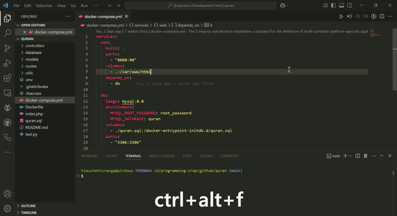

# Structure Map

A Visual Studio Code extension to list and map your project folder structure in a markdown file, including information about ignored files and folders based on `.gitignore`.

---

## Features

- Automatically generates a hierarchical representation of your project's folder structure.
- Supports recursive listing of folders and files.
- Includes ignored files and folders based on `.gitignore` in the summary.
- Saves the folder structure to a markdown file in the root of your project.
- Folders are prioritized at the top of the structure.
- Easily accessible with a custom keyboard shortcut.

## Quick Demo  

To see how the **Structure Map** works, check out this quick demo:  

  

---

## Installation

1. Open Visual Studio Code.
2. Go to the **Extensions** view by clicking the Extensions icon in the Activity Bar on the side of the window or by pressing `Ctrl+Shift+X`.
3. Search for **Structure Map** and click **Install**.

Alternatively, you can install it directly from the marketplace by visiting the [Structure Map Extension Page](https://marketplace.visualstudio.com/items?itemName=ashen-chathuranga.structure-map) and clicking the **Install** button.


## Usage

### Command Palette:

1. Open your project folder in VS Code.
2. Press `Ctrl+Shift+P` (or `Cmd+Shift+P` on macOS) to open the Command Palette.
3. Type **Structure Map: Create Folder Structure** and press `Enter`. This will generate a `folder_structure.md` file in your root directory.

### Keyboard Shortcut:

By default, you can use the following keyboard shortcut to generate the folder structure file:

- **Windows/Linux**: `Ctrl+Alt+F`
- **macOS**: `Cmd+Alt+F`

The extension will create a `folder_structure.md` file with the project folder structure in markdown format, starting with the root folder and prioritizing folders before files.

---

## Output Format

The generated `folder_structure.md` file will have the following format:

```plaintext
quran
├── controllers/
│   ├── ChapterController.php [2.08 KB]
│   └── EditionController.php [601 bytes]
├── database/
│   └── Database.php [1.08 KB]
├── models/
│   ├── EditionModel.php [459 bytes]
│   └── QuranModel.php [2.35 KB]
├── routes/
│   └── api.php [2.16 KB]
├── utils/
│   └── loadEnv.php [768 bytes]
├── Dockerfile [310 bytes]
├── README.md [6.02 KB]
├── docker-compose.yml [358 bytes]
├── folder-structure.md [1023 bytes]
├── index.php [67 bytes]
├── quran.sql [166.42 MB]
└── test.py [320 bytes]
```


### Summary

```plaintext
Root Folder: quran
Total Folders: 5
Total Files: 14
File Types:
  - .yml Files: 1
  - No Extension Files: 1
  - .md Files: 2
  - .php Files: 8
  - .sql Files: 1
  - .py Files: 1
Largest File: quran.sql [166.42 MB]
Smallest File: index.php [67 bytes]
Total Project Size: 166.43 MB
Ignored Files and Folders:
  - None
```

---

## Configuration

By default, the extension will generate the folder structure of the **current workspace** and save it as `folder_structure.md` in the root folder.

You can customize the folder structure output by modifying the following:

1. The keyboard shortcut can be customized by modifying the keybindings in VS Code.
2. The markdown output format is customizable in the extension code.
3. Ignored files and folders are detected using the `.gitignore` file in the root directory.

---

## Contributing

If you want to contribute to the development of this extension, feel free to fork the repository and submit pull requests with your improvements.

1. Fork the repository.
2. Create a new branch.
3. Make your changes.
4. Test your changes.
5. Submit a pull request.

---

## License

This project is licensed under the MIT License.
